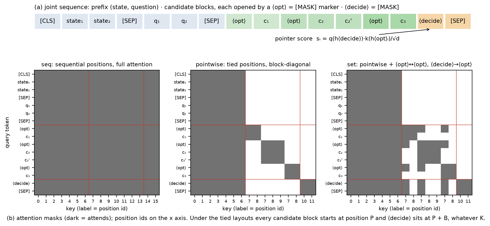
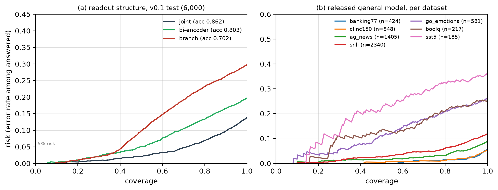
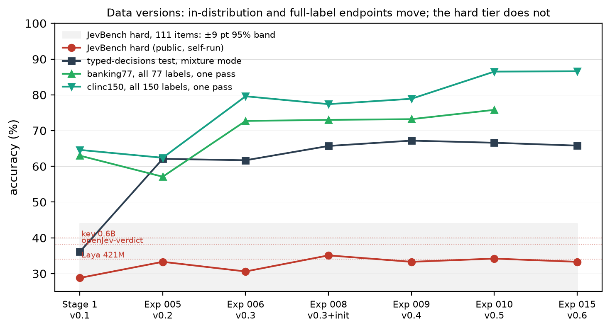

# Reading Decisions out of a Masked Language Model: Readout Position, Candidate Topology and Objective in a 150M Typed-Decision Encoder

*Draft v0.1, 2026-09-24. Working paper for arXiv (cs.CL / cs.LG). Numbers are taken from the experiment records in `docs/RESULTS_*.md`; every table names the experiment it comes from.*

## Abstract

Typed-decision models answer bounded questions about a state: given a context, a question and a finite candidate set, return a calibrated probability over the candidates in one forward pass, without generating text. We study how to build such a model from a 150M-parameter masked-language-model encoder (ModernBERT-base) and ask which design choices actually matter. Three findings. **(1) Readout position dominates.** Reading each candidate out of the pretrained `[MASK]` token rather than a newly added marker token raises accuracy from 60.0 ± 1.5 to 86.5 ± 0.2 on a seven-dataset mixture (3 seeds), halves negative log-likelihood, and removes almost all seed variance; span pooling over the candidate text adds nothing. The effect is backbone-dependent: on DeBERTa-v3-base a new marker is only 0.5 points behind `[MASK]`, so `[MASK]` is the robust choice rather than the only one. **(2) The objective barely matters.** Soft cross-entropy, Brier, and their combination are indistinguishable in accuracy, NLL, ECE and AURC; post-hoc temperatures are 1.01 to 1.04; a separate confidence head does not improve error detection over max-probability. The only term with a measurable effect is a permutation-consistency regulariser, and it affects only permutation consistency. **(3) Candidate topology governs extrapolation in the number of candidates.** Laying candidates out sequentially breaks when the candidate set at inference (77 or 150 labels) is larger than at training (≤ 12): 57.9 ± 1.8 accuracy in a single forward pass. Tying every candidate block to the same position id and masking attention so that each candidate sees only the prefix and itself makes the model permutation-equivariant by construction and independent of which other candidates are present; the same single pass reaches 75.9 ± 0.6 (+18.0 points, 3 seeds), with no cost in-distribution (85.6 vs 85.7) and a permutation-consistency rate of 0.999 without any regulariser. Targeted data buys in-distribution and task-level transfer (a specialist reaches 76.3% / Brier 0.063 on a public typed-decisions test set, matching the best open 150M model on accuracy, beating it on Brier, and clearly ahead of a commercial API's reported 72.7% / 0.148; 22 LegalBench rule-application tasks never seen in training reach 82%) but not knowledge-heavy reasoning: six data versions sit at 33 to 35% on the hard tier of a public decision benchmark, level with same-size open encoders, which locates the ceiling of the data lever at this size. The result is a recipe with three load-bearing parts, `[MASK]` readout, position-tied candidates and any proper scoring rule, and a released 150M model, data generators, evaluation protocol and experiment records that reproduce every number here.

## 1 Introduction

A growing class of products exposes a "System-One" interface: the caller passes a *state* (a document, a conversation, a record), a *question*, and a bounded answer space, and receives a typed answer with a probability, in tens of milliseconds and without free-form generation. The commercial reference point is TypeSafe's Jev API; a community of open re-implementations followed (openJev-verdict, Laya, kev, SemIf, NanoJev, among others), most of them small encoders or small decoders with a pointer or option-logit readout, and a public benchmark, JevBench, now measures more than eighty of them.

The engineering recipe is shared across these systems and is not new: encode `[state; question; candidates]` once, score each candidate against a decision token, train with a proper scoring rule. What is missing is an account of *which parts of the recipe carry the result*. Ablations in this space are scarce because the systems are products, not studies; the few that report ablations do so on a single seed and a single benchmark.

This paper is a controlled study on one 150M encoder. We hold the backbone, the data and the training budget fixed and vary three things that a practitioner has to decide: where the candidate representation is read from (readout position), how candidates are laid out and allowed to attend to each other inside the encoder (candidate topology), and which proper scoring rule is optimised (objective). We then ask what additional data buys at this size.

Contributions:

1. **Readout position.** A 2 × 2 × 3-seed ablation (marker token × span pooling) shows that reusing the MLM `[MASK]` token as the candidate marker is worth 26 accuracy points on ModernBERT-base, that span pooling is worth nothing, and that a new marker token is unstable across seeds (± 1.5 to 5.2 points) where `[MASK]` is not (± 0.2). A replication on DeBERTa-v3-base shows a 0.5-point gap instead, so the finding is about robustness of `[MASK]`, not a universal failure of new tokens (§5.1).
2. **Readout structure.** Among a joint cross-encoder, a bi-encoder and a two-branch encoder with cross-attention, the joint readout wins by 6 to 17 points, with the gap concentrated on tasks where candidates must interact with the state (§5.2).
3. **Objective.** Five objective arms (soft-CE, + Brier, Brier only, + confidence head, − permutation-KL) are statistically indistinguishable on accuracy and every calibration metric; calibration comes from the proper scoring rule itself, not from post-hoc temperature (§5.3).
4. **Candidate topology.** A preregistered comparison of sequential, position-tied *pointwise* and position-tied *set* layouts (3 seeds) shows that position tying fixes candidate-count extrapolation (+18.0 points at K ≥ 77 in one forward pass), makes permutation equivariance exact, and costs nothing in-distribution; the pointwise variant is additionally independent of irrelevant alternatives, which we verify numerically (§5.4). We state the two structural properties as propositions.
5. **Data limits.** Across six data versions (rule-generated policy, multi-hop and temporal worlds; LegalBench; a public typed-decisions training set) we report what improves (in-distribution, task-level transfer to 22 unseen legal tasks, a public typed-decisions test set) and what does not (the hard tier of JevBench, flat at 33 to 35%) (§5.5, §5.6).

The pointer readout, the objectives and the encoders are standard components, and we cite their sources; what is new is the position-tied candidate topology with its two provable properties, and the controlled evidence for which parts of the recipe carry the result. Where we quote the commercial API's numbers they are third-party measurements.

## 2 Related work

**Zero-shot and few-shot classification with encoders.** NLI-based zero-shot classification recasts a label as a hypothesis and scores entailment with a cross-encoder. TARS and GLiClass encode label descriptions jointly with the input and read a score per label from a marker token; label-embedding bi-encoders score labels independently of the input. Our joint readout is the GLiClass family; our bi-encoder arm is the label-embedding family. Cross-encoder rerankers (e.g. Qwen3-Reranker, bge-reranker) score one candidate per pass; JevBench measures several of them with a neutral adapter.

**Open typed-decision models.** openJev-verdict (ModernBERT-base, 149.6M) and Laya (421M) are encoder models with a pointer readout; kev, SemIf, Hopper, JevK5 and most other JevBench entrants are 2B to 27B decoders with an option-logit readout and LoRA. We use published numbers for these systems and re-implement none of them. Our contribution relative to this line is the controlled ablation, not a new system.

**Calibration and selective prediction.** Proper scoring rules (log, Brier, ranked probability score) share the same population optimum; temperature scaling corrects a fitted model's global miscalibration; ECE with equal-mass bins is biased upward at small n, so we report a noise floor computed on label-shuffled data; AURC and risk–coverage curves summarise selective prediction. We use these as instruments, and our finding on objectives (§5.3) is the empirical counterpart of the shared-optimum property.

**Permutation invariance for option scoring.** Order sensitivity of option-scoring LLMs is well documented, and the usual remedies are debiasing at inference or consistency regularisation at training. Our position-tied topology removes the sensitivity structurally, at the encoder's attention mask and position ids; it is closest in spirit to set-encoders with shared position ids for parallel contexts and to "parallel context windows", applied here to candidates rather than documents.

## 3 Model

### 3.1 One primitive, three question types

Every question is an instance of

  P(candidate | state, question, candidate set),

with a candidate set of size 2 to 255 given at run time. Three question types share this form: **noul** (yes/no, or "none of the above" over a label set), **choice** (pick one of K labels or options), and **score** (pick one of K ordered levels). The output is a distribution over the candidates from one forward pass. No vocabulary is involved in the readout, so the candidate set is free at inference.

The joint sequence is

  `[CLS] state [SEP] question [SEP] ⟨opt⟩ c₁ ⟨opt⟩ c₂ … ⟨opt⟩ c_K ⟨decide⟩ [SEP]`

with a state budget of 448 tokens (1,024 in the production configuration) and 24 tokens per candidate (Figure 1a).

### 3.2 Readout

Let h be the encoder's last hidden states. The candidate representation is the hidden state at its marker ⟨opt⟩ (optionally plus the mean over the candidate's text span); for **score** questions a learned ordinal-level embedding is added. The decision representation is the hidden state at ⟨decide⟩. Scores are a pointer product

  sᵢ = (W_q LN(h_decide)) · (W_k LN(h_optᵢ)) / √d + b,

softmaxed over the candidate mask. The head has under 1M parameters; the backbone (149.6M) is fine-tuned in full.

**Marker token.** The marker ⟨opt⟩ and ⟨decide⟩ is either the backbone's MLM `[MASK]` token (`marker=mask`) or a pair of newly added special tokens (`marker=new`). This is the manipulated variable of §5.1.

**Readout structure.** We compare three placements of the encoder: *joint* (one pass over the whole sequence, above), *bi-encoder* (state+question and each candidate encoded separately, scored by the same pointer product), and *branch* (state encoded once; question and candidates encoded in a second pass through the backbone with cross-attention to the state's hidden states). Branch is motivated by the "one state, many questions" workload; §5.2 reports its accuracy and training cost.

### 3.3 Candidate topology

Inside the joint sequence the candidates can be arranged in three ways (Figure 1b, which is rendered from the released mask code on a toy example). Let the prefix be `[CLS] state [SEP] question [SEP]` of length P, and let candidate block i be `⟨opt⟩ cᵢ` of length ≤ B (B = 25).

- **seq.** Ordinary position ids P, P+1, …; full attention. This is the default in all systems we know of.
- **pointwise.** Every candidate block gets position ids P, …, P+|blockᵢ|−1; ⟨decide⟩ and the closing `[SEP]` sit at fixed positions P+B, P+B+1. Attention is masked so that prefix tokens see only the prefix, candidate tokens see the prefix and their own block, and ⟨decide⟩ sees only the prefix.
- **set.** As pointwise, plus: every ⟨opt⟩ marker sees every other ⟨opt⟩ marker, and ⟨decide⟩ sees every ⟨opt⟩ marker.

For ModernBERT the sliding-window layers use a window measured in *position ids*, not sequence index, so every block sees the same stretch of prefix wherever it sits in the sequence. Two properties follow directly from the construction.

**Proposition 1 (permutation equivariance).** Under pointwise and set topologies, for any permutation π of the candidates, the vector of logits satisfies s(π·C) = π·s(C). *Proof sketch.* Position ids and attention masks of every block are identical up to relabelling of the block index, and the encoder's computation is invariant to sequence order given position ids and masks; the pointer head is applied per block. ∎

**Proposition 2 (independence of irrelevant alternatives, pointwise only).** Under the pointwise topology, logit sᵢ is a function of (prefix, cᵢ) alone. Hence for any subset S ⊆ C containing i, P(i | S) = P(i | C) / Σ_{j∈S} P(j | C): the distribution over a subset is the renormalised distribution over the full set. *Proof sketch.* No token in block i attends to any token of another block, and ⟨decide⟩ attends only to the prefix. ∎

Proposition 2 has a practical corollary: a model trained on candidate sets of size ≤ 12 defines, for any K, the *same* per-candidate function, so nothing is extrapolated when K grows to 150. Under seq, growing K moves candidates to position ids never seen in training and dilutes attention over the prefix; under set, the ⟨opt⟩–⟨opt⟩ interaction is trained only on small sets. §5.4 tests all three. In closed-world classification IIA holds for the Bayes predictor, so pointwise loses nothing in principle; whether candidate interaction helps in practice is an empirical question the same experiment answers.

#

**Figure 1.** (a) The joint sequence: prefix, candidate blocks each opened by a ⟨opt⟩ marker, a ⟨decide⟩ token; both markers are the backbone's `[MASK]`. (b) Attention masks and position ids of the three candidate topologies on a toy example with three candidates, generated from the released code. Under pointwise and set, every candidate block starts at position P and ⟨decide⟩ sits at P + B regardless of K, and no candidate token attends to another block (pointwise) or only the ⟨opt⟩ markers do (set).

## 3.4 Objective

The training loss is

  L = soft-CE(p, y) + λ_RPS · RPS(p, y) · 1[score] + λ_perm · ½[KL(p‖p_π) + KL(p_π‖p)],

where y is the (possibly soft) target, RPS is the ranked probability score over cumulative distributions for ordinal questions, and the last term compares two forward passes whose candidates were permuted (only meaningful under seq; under the tied topologies it is identically zero by Proposition 1). Brier loss and a separately trained confidence head are the additional arms of §5.3. All terms are standard; we introduce no new objective. (An RLCD-style paired proper-reward policy-gradient surrogate is implemented in the released code but excluded from every claim in this paper.)

## 4 Data and evaluation protocol

### 4.1 Data

**v0.1 (seven public classification sets).** banking77, clinc150, ag_news, sst5, go_emotions, boolq, snli, recast into the three primitives with several question templates per source example (Table 1). Splits are by *source example* (80/10/10); the evaluation partitions contain one paraphrase from a training template and one from a held-out template per example, so template memorisation is measurable. Negative candidates are balanced by construction.

**v0.2 to v0.6 (targeted breadth).** Three rule-generated worlds whose labels are computed by a program rather than a model: *policy* (check a request against a list of clauses), *multi-hop* (follow references across a small JSON record), *temporal* (date and quantity arithmetic). Generators, templates and seeds are released; templates are sampled independently of the label; no benchmark item was consulted in their design, and refund/receipt scenarios were excluded deliberately. LegalBench contributes 118 rule-application tasks, of which 22 are held out *as tasks* for task-level out-of-distribution evaluation. The public typed-decisions training split (6,000 decisions, teacher-labelled) is included in the mixture, as the open re-implementations do; its 2,000-decision test split is reported separately and never merged into our test set. HotpotQA was included in v0.2 to v0.5 and removed in v0.6 after we found its difficulty came from distractor selection rather than reasoning (§5.5). Table 1 lists sizes and licences.

**Table 1. Datasets. Splits are by source example; "examples" counts the recast decisions (several question templates per source example). Licences as recorded in the data registry.**

| dataset | version | role | source examples | decisions | primitives | licence |
|---|---|---|---|---|---|---|
| banking77 | v0.1 | train + test | 13,069 | 47,060 | noul, choice | CC-BY-4.0 |
| clinc150 | v0.1 | train + test | 23,850 | 83,654 | choice, noul | CC-BY-3.0 |
| ag_news | v0.1 | train + test | 40,000 | 144,010 | noul, choice | research use (AG corpus terms) |
| sst5 | v0.1 | train + test | 11,855 | 40,544 | noul, score | research |
| go_emotions | v0.1 | train + test | 15,775 | 56,664 | choice, noul | Apache-2.0 |
| boolq | v0.1 | train + test | 12,697 | 32,997 | noul | CC-BY-SA-3.0 |
| snli | v0.1 | train + test | 79,832 | 325,014 | choice, noul | CC-BY-SA-4.0 |
| synth_policy | v0.2+ | train + test | 8,000 → 20,000 worlds | 32,000 → 80,000 | noul, choice, score | generated here, Apache-2.0 |
| synth_multihop | v0.2+ | train + test | 8,000 → 20,000 | 40,000 → 100,000 | noul, choice, score | generated here, Apache-2.0 |
| synth_temporal | v0.2+ | train + test | 8,000 → 20,000 | 48,000 → 120,000 | noul, choice, score | generated here, Apache-2.0 |
| LegalBench (118 tasks, 22 held out) | v0.2+ | train + task-level OOD test | 47,256 | 47,256 | noul, choice | CC-BY-4.0 (per task) |
| HotpotQA | v0.2–v0.5 only | train | 30,000 | 78,201 | choice, noul | CC-BY-SA-4.0 |
| typed-decisions | v0.2+ | train split in mixture; test split reported separately | 6,000 / 2,000 | 6,000 / 2,000 | noul, choice, score | see dataset card |
| JevBench public items | — | evaluation only | 231 | 231 | noul, choice, score | MIT (harness) |

v0.1 totals: 661,081 train / 34,386 calibration / 34,476 test decisions; training runs cap each dataset (10,000 to 20,000 examples per dataset) so that snli, which is half of v0.1, does not dominate. v0.2 totals: 865,818 / 53,698 / 61,884.

**Contamination.** A 13-gram overlap check between every training state and the 231 public JevBench items finds zero overlap. The typed-decisions test set shares 13-grams with its own training split in 89% of items, all from the JSON field skeleton of the generating workflow; exact state overlap is zero.

### 4.2 Protocol

Every reported unit has ≥ 2,000 items. Paired differences use a 10,000-sample bootstrap resampled by source example, plus an exact McNemar test for accuracy. Calibration is reported as NLL, Brier, and ECE with 15 equal-mass bins together with a *noise floor* (the ECE obtained under label shuffling at the same n); selective prediction as AURC, risk at fixed coverage and coverage at 1% and 5% risk. Control blocks accompany the main tables: *no state*, *shuffled state* (state from another item), *candidate permutation* (argmax agreement and mean total variation between the original and a random permutation), and *held-out templates*. Where a post-hoc temperature is reported it is fitted per bucket on the calibration split and applied to the test split; in every experiment below it is between 0.77 and 1.09 and changes no conclusion, so raw probabilities are reported.

Seeds: the readout-position and topology studies use three seeds; the objective study, the readout-structure study and the data-version series are single-seed, and we say so wherever a number is quoted. Where the effect of interest is many times the seed variance measured in the three-seed studies (± 0.2 points for the default configuration) we treat single-seed differences above 1.5 points as real and below as noise.

### 4.3 External benchmarks

*typed-decisions* (public, teacher-labelled, 2,000 test decisions): we report a **specialist** mode (fine-tuned on its 6,000 training decisions, comparable to the open re-implementations' reported numbers) and a **mixture** mode (the training split is 1/13 of the mixture) separately. *JevBench* (534 public decisions in easy/standard/hard tiers plus a private sealed set): we report the 231 public items we can run ourselves (48/72/111) and flag every number as self-run; the maintainers' official score, which includes 133 held-out and 308 sealed items, was requested and had not been produced at the time of writing.

## 5 Experiments

Unless stated otherwise, the base configuration is ModernBERT-base fine-tuned in full for one epoch on the v0.1 mixture capped at 10,000 training examples per dataset (≈ 70k), micro-batch 4 × 8 accumulation, learning rates 2e-5 (backbone) and 1e-4 (head), soft-CE + 0.5·RPS + 0.1·perm-KL, on a single 8 GB GPU. Test numbers are on the v0.1 test split (6,000 or 5,700 items as noted).

### 5.1 Readout position (Exp 017, Exp 018)

Table 2 crosses the marker token (`[MASK]` vs new special tokens) with candidate pooling (marker only vs marker + span mean), three seeds per cell, in the base configuration.

**Table 2. Readout position, ModernBERT-base, v0.1 test (5,700), mean ± sd over 3 seeds.**

| marker | pooling | accuracy | NLL | cov@5% risk |
|---|---|---|---|---|
| `[MASK]` | marker | **0.865 ± 0.002** | **0.333 ± 0.001** | 0.72 |
| `[MASK]` | marker + span | 0.863 ± 0.002 | 0.337 ± 0.003 | 0.72 |
| new token | marker | 0.600 ± 0.015 | 0.755 ± 0.019 | 0.12 |
| new token | marker + span | 0.606 ± 0.052 | 0.730 ± 0.090 | 0.14 |

The whole effect is on the marker axis: 26.5 points of accuracy, half the NLL, and coverage at 5% risk from 12% to 72%. Span pooling changes nothing in either row (differences of 0.2 to 0.6 points, inside seed variance); an earlier single-seed comparison (Exp 001) that credited part of the gain to span pooling was wrong. The new-token rows are also unstable: seed-to-seed spreads of 3 to 10 points against 0.5 for `[MASK]`. Per dataset, the gap is largest where the task needs the candidate to be read against the context: snli is at chance with a new token (0.48 to 0.52) and at 0.86 with `[MASK]`; ordinal *score* questions are at 0.26 to 0.38 versus 0.55.

**Is it the token or the backbone?** Exp 018 repeats two cells on DeBERTa-v3-base (184M, 512 positions, one seed; Table 3). There the new token is only 0.5 points behind `[MASK]`. The `[MASK]` readout is therefore the *robust* choice across backbones, while whether a freshly initialised marker can be learned in one epoch depends on the backbone. DeBERTa-v3-base is also 1.9 points better than ModernBERT-base in this setting, at twice the step time and with a 512-token limit that rules out the 1,024-token states used later.

**Table 3. Backbone check, one seed.**

| backbone | marker | accuracy | NLL |
|---|---|---|---|
| DeBERTa-v3-base | `[MASK]` + span | 0.882 | 0.301 |
| DeBERTa-v3-base | new token | 0.877 | 0.318 |
| ModernBERT-base (Table 2 mean) | `[MASK]` + span | 0.863 | 0.337 |
| ModernBERT-base (Table 2 mean) | new token | 0.600 | 0.755 |

### 5.2 Readout structure (Exp 001)

With the `[MASK]` + span readout fixed, Table 4 compares the three encoder placements (single seed, base configuration, 6,000 test items). A first branch variant in which the branch did not pass through the backbone stopped at 42% on the calibration split, the level of the *no state* control, and was discarded as a structural defect; the reported branch encodes the branch through the backbone and then cross-attends to the state.

**Table 4. Readout structure, v0.1 test (6,000).**

| readout | accuracy | NLL | AURC | cov@5% | training time |
|---|---|---|---|---|---|
| joint | **0.862** | **0.341** | **0.036** | **0.71** | 1× |
| bi-encoder | 0.803 | 0.444 | 0.070 | 0.50 | ≈ 1× |
| branch | 0.702 | 0.548 | 0.115 | 0.41 | ≈ 2× |

Figure 3a shows the risk–coverage curves of the three. The joint readout leads the bi-encoder by 5.9 points overall and by 4 to 7 points on snli, boolq and go_emotions, the three sets where a candidate must be read against the state; the intent-routing sets, where a label is a short phrase, are within 1 to 2 points. Branch trails by 16 points and trains twice as slowly, because in a random batch no state is shared. The bi-encoder is exactly permutation-invariant (agreement 1.000) and the joint readout is at 0.980 with λ_perm = 0.1; §5.4 makes the joint readout exact as well.

**Figure 3.** Risk–coverage curves. (a) The three readout structures of Table 4 on the v0.1 test split: the joint readout dominates at every coverage. (b) The released general model per dataset (v0.1 test, 6,000 items, accuracy 0.875): banking77 and clinc150 stay under 5% risk at essentially full coverage, ag_news and snli at about 85% and 75%; ordinal sentiment and fine-grained emotion, where labels overlap, leave the 5% band early.

### 5.3 Objective (Exp 003)

Table 5 varies the objective with everything else fixed (single seed, 6,000 test items; the minimum detectable paired difference at this n is about 1.5 points).

**Table 5. Objective arms, v0.1 test (6,000).**

| arm | acc | NLL | Brier | ECE (floor) | AURC | AUROC | cov@5% | perm. agreement | temperature |
|---|---|---|---|---|---|---|---|---|---|
| soft-CE + 0.5 RPS + 0.1 perm-KL | 0.862 | 0.341 | 0.182 | 0.011 (0.010) | 0.036 | 0.845 | 0.71 | 0.980 | 1.02 |
| + Brier 1.0 | 0.859 | 0.352 | 0.189 | 0.009 (0.011) | 0.039 | 0.837 | 0.70 | 0.975 | 1.01 |
| Brier only | 0.857 | 0.353 | 0.188 | 0.016 (0.011) | 0.039 | 0.842 | 0.71 | 0.979 | 1.02 |
| + confidence head | 0.860 | 0.353 | 0.189 | 0.013 (0.010) | 0.039 | 0.835 | 0.70 | 0.976 | 1.04 |
| − perm-KL | 0.858 | 0.351 | 0.187 | 0.012 (0.010) | 0.039 | 0.843 | 0.71 | **0.923** | 1.04 |

Every accuracy and calibration metric is within the detection limit across arms; ECE is at its noise floor in all of them; the fitted temperature is 1.01 to 1.04, so temperature scaling has nothing to correct. The confidence head does not improve error detection over max-probability (AUROC 0.835 vs 0.845). The only measurable effect is the permutation-KL term, and it moves only permutation agreement (0.923 → 0.980; 0.986 at λ = 0.3 in the production recipe) at about 80% extra training cost for the second forward pass. Ordinal *score* questions are equally weak in all five arms (0.52 to 0.56), so their weakness is not an objective problem.

### 5.4 Candidate topology and candidate count (Exp 016, Stage 1, Exp 006, Exp 010)

**The problem.** A joint readout trained on candidate sets of size ≤ 12 is asked at inference to score the full label set of banking77 (K = 77) or clinc150 (K = 150). Stage 1 of the seq model scores 96 to 97% on subsets of ≤ 12 labels but 63.0% / 64.6% on the full sets in one pass. Two remedies that need no retraining recover about half the gap: scoring candidates in chunks of 12 (76.2 / 80.2) and adding a champion tournament among chunk winners (77.1 / 84.7). Raising the training-time candidate cap to 40 (Exp 006) recovers a similar amount (72.7 / 79.6) and does not stack with chunking; rendering the full label set with probability 0.3 at training time (Exp 010) reaches 75.8 / 86.5.

**The preregistered test.** Exp 016 retrains the base configuration (without perm-KL, so that seq has no consistency help) under the three topologies of §3.3, three seeds each, and evaluates on all 3,567 test items with K ≥ 77 in one forward pass with a 4,096-token budget so that no state is truncated. The primary endpoint, the paired accuracy difference pointwise − seq, was written down before training.

**Table 6. Candidate topology, mean ± sd over 3 seeds. Full label sets: banking77 + clinc150, K ≥ 77, n = 3,567. In-distribution: v0.1 test, first 6,000.**

| topology | full K, one pass acc / NLL | full K, chunk 12 + tournament acc / NLL | in-distribution acc / NLL | perm. agreement | drop-one mean TV |
|---|---|---|---|---|---|
| seq | 0.579 ± 0.018 / 1.852 ± 0.135 | 0.738 ± 0.003 / 0.949 ± 0.022 | 0.857 ± 0.002 / 0.353 | 0.971 | 0.025 |
| pointwise | **0.759 ± 0.006 / 0.835 ± 0.020** | 0.758 ± 0.006 / 0.835 ± 0.020 | 0.856 ± 0.002 / 0.351 | 0.999 | 0.001 |
| set | 0.730 ± 0.002 / 1.031 ± 0.045 | 0.753 ± 0.003 / 0.860 ± 0.006 | 0.857 ± 0.002 / 0.350 | 0.999 | 0.006 |

Findings.

1. **Position tying fixes extrapolation.** Pointwise beats seq by 18.0 points in one forward pass (seed 0 paired difference +19.2, 95% CI [+17.6, +20.8], McNemar p < 10⁻¹⁰⁰), with all three seeds between 17 and 20 points and NLL lower by 1.0. The seq failure is also the least stable arm (sd 1.8 vs 0.2 to 0.6): extrapolating to unseen position ids is itself seed-dependent.
2. **Pointwise needs no inference-time heuristic.** Its chunked and single-pass results coincide (0.759 vs 0.758; the maximum logit difference in fp32 is 2.6 × 10⁻⁴ with zero argmax flips), as Proposition 2 requires. Seq with its best inference (chunk + tournament) still trails pointwise by 2.0 points with non-overlapping seed ranges.
3. **No in-distribution cost.** The three arms are within 0.1 points in-distribution, below seed variance. The tied topologies reach permutation agreement 0.999 without a regulariser (1.000 in fp32; the residual is bf16 rounding), where seq with λ_perm = 0.3 reached 0.986 at 80% higher training cost.
4. **Candidate interaction.** Set is 2.9 points below pointwise at full K in one pass and equal to it after chunking; in-distribution, on the single-seed paired test it was +0.5 points (CI [+0.1, +1.0]) and −0.006 NLL, concentrated on snli, boolq and clinc150, but this is inside the three-seed spread. This matches the closed-world prediction: IIA holds for the Bayes predictor, so interaction cannot change the optimum; it can only change learning efficiency on the sets seen in training, and it has no extrapolation guarantee.
5. **What this does not answer.** On sets whose options were *designed* to be compared (typed-decisions, JevBench) the three arms differ by ≤ 1.4 points zero-shot; a specialist-stage comparison is left for future work.

### 5.5 What data buys (Exp 005 to 015)

Starting from the Stage 1 seq model (v0.1, two epochs), we added data in six steps while holding the recipe fixed (single seed each). Table 7 and Figure 2 report the endpoints that moved and the one that did not.

**Table 7. Data versions (single seed). JevBench hard is 111 public items (± 9 points at 95%); typed-decisions is the 2,000-item test set in mixture mode (accuracy / Brier); full-K is one forward pass.**

| model | data | JevBench hard | typed-decisions (mixture) | banking77 K=77 | clinc150 K=150 | v0.1 test |
|---|---|---|---|---|---|---|
| Stage 1 | v0.1 | 28.8% | 36.1 / 0.278 (zero-shot) | 63.0% | 64.6% | 88.7% |
| Exp 005 | v0.2: + rule worlds, LegalBench, HotpotQA, typed-decisions train | 33.3% | 62.1 / 0.125 | 57.1% | 62.4% | 87.5% |
| Exp 006 | v0.3: + K curriculum (≤ 40) | 30.6% | 61.7 / 0.127 | 72.7% | 79.6% | — |
| Exp 008 | v0.3 + GLiClass init + 1,024-token states | **35.1%** | 65.7 / 0.110 | 73.0% | 77.4% | 87.6% |
| Exp 009 | v0.4: multi-hop states compressed, HotpotQA shuffled | 33.3% | 67.2 / 0.110 | 73.2% | 78.9% | — |
| Exp 010 | v0.5: + 30% full-label rendering | 34.2% | 66.6 / 0.109 | **75.8%** | **86.5%** | 87.5% |
| Exp 015 | v0.6: − HotpotQA, rule worlds × 2.5 | 33.3% | 65.8 / 0.111 | — | 86.6% | 87.4% |

**Figure 2.** Endpoints across data versions (Table 7). In-distribution and full-label endpoints move by 20 to 30 points; the JevBench hard tier stays inside its ± 9-point sampling band, level with the same-size open encoders (dotted lines).

What moved: the typed-decisions test set (36 → 67 in mixture mode, from including its training split, the same practice as the open re-implementations); full-label intent routing (from the K curriculum and full-set rendering, §5.4); the rule worlds' own test sets (policy 84%, multi-hop 74 to 76% after fixing a truncation bug that had made 66% of multi-hop states unanswerable, temporal 69%); and 22 LegalBench tasks never seen in training, at **82.0%** (task-level out-of-distribution, 5k items; 75.3% on a 2.4k re-sample of a later version). Initialising from the GLiClass encoder added 4 points on typed-decisions and nothing on full-label sets.

What did not move: the JevBench hard tier. Six data versions land between 33.3 and 35.1% on 111 items, whose 95% interval is ± 9 points; same-size open encoders sit at 34 to 40% (Laya 421M 34.1, openJev-verdict 38.2, kev 0.6B 40.0; commercial Jev 74.1). By item family, the failures are multi-hop (4/18), trap (3/8), temporal-numeric (5/15) and ambiguous (1/7) questions, which need world knowledge or arithmetic that the rule worlds do not supply. HotpotQA, added for multi-hop, scored 96% on its own test set even after shuffling paragraph order, so its difficulty lay in distractor choice rather than reasoning, and it transferred nothing; it was removed in v0.6 at no cost. We read the plateau as an empirical ceiling of this data-side lever at 150M parameters, and stopped.

### 5.6 External comparison

**typed-decisions, specialist mode.** A specialist stage on the Exp 010 checkpoint (its 5,400 training decisions, 8 epochs, halved learning rate, checkpoint chosen by calibration-split NLL; Exp 014) reaches the numbers in Table 8. Three seeds give identical accuracy (1,526/2,000) and Brier 0.0627 ± 0.0003: from the same initialisation with a small learning rate the specialist stage is nearly deterministic, and the uncertainty is test-set sampling (± 1.9 points).

**Table 8. typed-decisions test set (2,000 decisions), specialist mode.**

| model | params | accuracy | Brier | source |
|---|---|---|---|---|
| this work, specialist (Exp 014, 3 seeds) | 150M | 76.3 [74.4, 78.2] | 0.063 | this paper |
| this work, three-specialist ensemble | 3 × 150M | 75.8 | 0.063 | this paper |
| dataset card's ModernBERT-base specialist | 150M | 64.6 | 0.119 | dataset card |
| openJev-verdict-2.0 (self-reported) | 150M | 77.1 | 0.064 | model card |
| Jev 1.13 (generalist, reported on the dataset card) | closed | 72.7 | 0.148 | dataset card |

Accuracy is on par with the best open 150M model (its 77.1 lies inside our interval) and Brier is equal or better; both are clearly ahead of the reported generalist API numbers. The specialist's ECE (0.14) is worse than its Brier suggests because the teacher labels are soft and the argmax-based ECE penalises matching them; temperature scaling does not improve it, and we report Brier and NLL as the primary calibration numbers here.

**JevBench, public items, self-run.** The released general model scores 100% easy, 65.3% standard and 35.1% hard on the 231 public items (Exp 008; the v0.5 model, Exp 010, scores 100 / 61.1 / 34.2 with Brier 0.552). These are self-run numbers with the released adapter; the official score, which adds 133 held-out and 308 sealed items and weights speed and cost, was requested through the benchmark's submission process and is pending. Under the benchmark's current scoring, a small public-to-sealed gap is rewarded; we make no prediction.

**Cost.** One decision with K ≤ 12 and a 448-token state is one encoder pass of ≈ 600 tokens, and the full-label clinc150 query (150 candidates, ≈ 4,000 tokens) is a single pass under the tied topologies. Latency and throughput were not measured in a controlled setting and are left to the benchmark's official run.

## 6 Analysis

**Why `[MASK]` and why not always.** Masked-language-model pretraining trains exactly one token type to summarise its context into a prediction: `[MASK]`. Reading a candidate through that token gives the pointer head a representation that is already a contextual summary at initialisation, so the head only has to learn a similarity; a new token starts from a random embedding and the encoder has to learn, from ≈ 70k decisions, both to attend from it and to attend to it. Three observations in our data support this reading over a capacity explanation: (i) the new-token arm's seed spread is ten times larger, the signature of an optimisation that sometimes finds the solution and sometimes does not; (ii) in a small-scale learning-curve check the `[MASK]` readout at 3,200 training examples matched the new-token readout at 16,000; (iii) the gap is largest on snli and the ordinal questions, where the candidate must be read *against* the state rather than matched as a phrase. The DeBERTa result shows the new token *can* be learned in one epoch on another backbone, so what differs is how far a fresh embedding is from a usable one, which depends on the embedding scale and position scheme of the backbone. We did not isolate the cause and list it as future work.

**Where calibration comes from.** Every proper scoring rule we tried yields a temperature of ≈ 1 and an ECE at its noise floor on the in-distribution test split, and the ranking of arms is inside the detection limit. The practical consequence is that a decision model of this kind does not need temperature scaling or a confidence head; max-probability is as good an abstention signal as a trained head, and the risk–coverage curve (Figure 3b, per dataset for the released model) is the property to report. Calibration *does* degrade where the model is wrong for reasons of knowledge: the hard judge items of JevBench have ECE 0.51 with severe over-confidence, and the unseen LegalBench tasks are over-confident (ECE 0.09) though accurate. Coverage at 5% risk, not ECE, is the number that changes what a deployment can automate: 89 to 95% on intent routing, 24% on boolq, 4% on ordinal scoring.

**What fails on the hard tier and why.** The hard-tier failures are concentrated in families where the answer is not in the state: trap and adversarial questions (needs to know the premise is false), temporal-numeric (needs arithmetic over several quantities), multi-hop over prose (needs to bind entities across sentences). Rule-generated worlds teach the *form* of these skills and the model learns them on the worlds' own tests (84 / 76 / 69%), but the transfer to natural items is nil, which is what one expects when the missing ingredient is content rather than form. Families that are classification in disguise (tool selection, fact lookup with the fact present, intent) are at or near ceiling from the first data version.

**Topology as a substitute for regularisation.** The permutation-KL term costs a second forward pass and reaches agreement 0.98 to 0.99; the tied topologies reach 1.000 in fp32 for free and additionally solve candidate-count extrapolation, which no regulariser addresses. The trade-off is expressivity: pointwise cannot represent option-relative judgements ("the more specific of these two"), and set restores interaction only among markers. In closed-world classification this costs nothing (Table 6), and we expect it to matter, if anywhere, on option sets designed to be compared; we have not measured that case beyond zero-shot.

## 7 Limitations and future work

Everything here is one 150M encoder trained on one 8 GB GPU; the hard-tier plateau is a statement about this size and the data lever, and a same-data comparison against a 0.6B decoder with an option-logit readout is the natural next control. Ordinal scoring is the weakest primitive under every objective and needs a readout that represents order, not another loss. The `[MASK]` effect is characterised rather than explained; a controlled embedding-initialisation study on ModernBERT would settle the mechanism. The official JevBench score, which adds held-out and sealed items, is pending. The second phase of this work adds coherence constraints across questions on one state, asymmetric block attention so that a cached state serves many questions, and specialist-stage comparisons of pointwise and set topologies on option sets that were designed to be compared.

## Reproducibility

Code (Apache-2.0), configs for every experiment, the data generators, the evaluation and paired-test scripts, the JevBench adapter and the full experiment logs are at the project repository; weights for the general and specialist models are on Hugging Face with per-file SHA-256 manifests. All numbers in this paper can be regenerated from the named configs; the preregistered endpoints and their timestamps are in `docs/PREREGISTRATION.md`.

## References

1. Warner, B., Chaffin, A., Clavié, B., et al. (2024). *Smarter, Better, Faster, Longer: A Modern Bidirectional Encoder for Fast, Memory Efficient, and Long Context Finetuning and Inference.* arXiv:2412.13663. (ModernBERT)
2. He, P., Gao, J., Chen, W. (2023). *DeBERTaV3: Improving DeBERTa using ELECTRA-Style Pre-Training with Gradient-Disentangled Embedding Sharing.* ICLR. (DeBERTa-v3)
3. Devlin, J., Chang, M.-W., Lee, K., Toutanova, K. (2019). *BERT: Pre-training of Deep Bidirectional Transformers for Language Understanding.* NAACL. (masked-language-model pretraining, `[MASK]`)
4. Yin, W., Hay, J., Roth, D. (2019). *Benchmarking Zero-shot Text Classification: Datasets, Evaluation and Entailment Approach.* EMNLP. (NLI-based zero-shot classification)
5. Halder, K., Akbik, A., Krapac, J., Vollgraf, R. (2020). *Task-Aware Representation of Sentences for Generic Text Classification.* COLING. (TARS)
6. Stepanov, I., Shtopko, M. (2024). *GLiClass: Generalist and Lightweight Model for Sequence Classification.* Knowledgator technical report; model `knowledgator/gliclass-modern-base-v3.0`. (GLiClass; encoder initialisation used here)
7. Zaratiana, U., Tomeh, N., Holat, P., Charnois, T. (2024). *GLiNER: Generalist Model for Named Entity Recognition using Bidirectional Transformer.* NAACL. (marker-token readout family)
8. Tunstall, L., Reimers, N., Jo, U. E. S., et al. (2022). *Efficient Few-Shot Learning Without Prompts.* arXiv:2209.11055. (SetFit)
9. Nogueira, R., Cho, K. (2019). *Passage Re-ranking with BERT.* arXiv:1901.04085. (cross-encoder reranking)
10. Zhang, Y., Li, M., Long, D., et al. (2025). *Qwen3 Embedding: Advancing Text Embedding and Reranking Through Foundation Models.* arXiv:2506.05176. (Qwen3-Reranker)
11. Chen, J., Xiao, S., Zhang, P., et al. (2024). *BGE M3-Embedding.* arXiv:2402.03216. (bge-reranker-v2-m3)
12. Gneiting, T., Raftery, A. E. (2007). *Strictly Proper Scoring Rules, Prediction, and Estimation.* JASA 102(477). (proper scoring rules share a population optimum)
13. Brier, G. W. (1950). *Verification of Forecasts Expressed in Terms of Probability.* Monthly Weather Review 78(1).
14. Epstein, E. S. (1969). *A Scoring System for Probability Forecasts of Ranked Categories.* Journal of Applied Meteorology 8(6). (ranked probability score)
15. Guo, C., Pleiss, G., Sun, Y., Weinberger, K. Q. (2017). *On Calibration of Modern Neural Networks.* ICML. (temperature scaling, ECE)
16. Nixon, J., Dusenberry, M., Zhang, L., Jerfel, G., Tran, D. (2019). *Measuring Calibration in Deep Learning.* CVPR Workshops. (equal-mass binning)
17. Roelofs, R., Cain, N., Shlens, J., Mozer, M. C. (2022). *Mitigating Bias in Calibration Error Estimation.* AISTATS. (small-sample bias of ECE; motivates the noise floor)
18. Geifman, Y., El-Yaniv, R. (2017). *Selective Classification for Deep Neural Networks.* NeurIPS. (risk–coverage)
19. Geifman, Y., Uziel, G., El-Yaniv, R. (2019). *Bias-Reduced Uncertainty Estimation for Deep Neural Classifiers.* ICLR. (AURC, E-AURC)
20. Hinton, G., Vinyals, O., Dean, J. (2015). *Distilling the Knowledge in a Neural Network.* arXiv:1503.02531. (soft targets)
21. Zheng, C., Zhou, H., Meng, F., Zhou, J., Huang, M. (2024). *Large Language Models Are Not Robust Multiple Choice Selectors.* ICLR. (option-order sensitivity)
22. Pezeshkpour, P., Hruschka, E. (2024). *Large Language Models Sensitivity to the Order of Options in Multiple-Choice Questions.* NAACL Findings.
23. Ratner, N., Levine, Y., Belinkov, Y., et al. (2023). *Parallel Context Windows for Large Language Models.* ACL. (shared position ids across parallel segments)
24. Lee, J., Lee, Y., Kim, J., Kosiorek, A., Choi, S., Teh, Y. W. (2019). *Set Transformer.* ICML. (permutation-equivariant set encoding)
25. Vinyals, O., Fortunato, M., Jaitly, N. (2015). *Pointer Networks.* NeurIPS. (pointer readout)
26. Luce, R. D. (1959). *Individual Choice Behavior.* Wiley. (independence of irrelevant alternatives)
27. Casanueva, I., Temčinas, T., Gerz, D., Henderson, M., Vulić, I. (2020). *Efficient Intent Detection with Dual Sentence Encoders.* ACL NLP4ConvAI. (banking77)
28. Larson, S., Mahendran, A., Peper, J. J., et al. (2019). *An Evaluation Dataset for Intent Classification and Out-of-Scope Prediction.* EMNLP. (clinc150)
29. Zhang, X., Zhao, J., LeCun, Y. (2015). *Character-level Convolutional Networks for Text Classification.* NeurIPS. (AG News)
30. Socher, R., Perelygin, A., Wu, J., et al. (2013). *Recursive Deep Models for Semantic Compositionality Over a Sentiment Treebank.* EMNLP. (SST-5)
31. Demszky, D., Movshovitz-Attias, D., Ko, J., et al. (2020). *GoEmotions: A Dataset of Fine-Grained Emotions.* ACL.
32. Clark, C., Lee, K., Chang, M.-W., et al. (2019). *BoolQ: Exploring the Surprising Difficulty of Natural Yes/No Questions.* NAACL.
33. Bowman, S. R., Angeli, G., Potts, C., Manning, C. D. (2015). *A Large Annotated Corpus for Learning Natural Language Inference.* EMNLP. (SNLI)
34. Guha, N., Nyarko, J., Ho, D. E., et al. (2023). *LegalBench: A Collaboratively Built Benchmark for Measuring Legal Reasoning in Large Language Models.* NeurIPS Datasets and Benchmarks.
35. Yang, Z., Qi, P., Zhang, S., et al. (2018). *HotpotQA: A Dataset for Diverse, Explainable Multi-hop Question Answering.* EMNLP.
36. Nie, Y., Zhou, X., Bansal, M. (2020). *What Can We Learn from Collective Human Opinions on Natural Language Inference Data?* EMNLP. (ChaosNLI; human label distributions)
37. Hu, E. J., Shen, Y., Wallis, P., et al. (2022). *LoRA: Low-Rank Adaptation of Large Language Models.* ICLR. (adapter used by most decoder entrants)
38. Standhartinger, F. et al. (2026). *JevBench: a benchmark for Jev-class decision models.* github.com/fstandhartinger/jevbench, results v1.4. (public items, sealed aggregates, third-party numbers for Jev, Laya, verdict, kev)
39. *typed-decisions* dataset card, Hugging Face `LocalLLaMA/typed-decisions` (2026). (teacher-labelled train/test splits; reported Jev 1.13 and ModernBERT-base specialist numbers)
40. *openJev-verdict-2.0* model card (2026). (ModernBERT-base 149.6M decision model; self-reported typed-decisions numbers)
41. TypeSafe AI. *Jev* API documentation, docs.typesafe.ai (2026). (the commercial System-One interface; no numbers taken from it directly)
42. Wolf, T., Debut, L., Sanh, V., et al. (2020). *Transformers: State-of-the-Art Natural Language Processing.* EMNLP Demos.
43. Loshchilov, I., Hutter, F. (2019). *Decoupled Weight Decay Regularization.* ICLR. (AdamW)

## Figures and tables (status)

- Figures 1–3 and Table 1: done (`docs/paper/figures/`, scripts `scripts/paper_fig{1,2,3}.py`, `scripts/dump_confidences.py`).
- Appendix (to assemble from the experiment records): control blocks for every experiment; synthetic-world templates; contamination-check output; JevBench hard tier by family for each data version.
