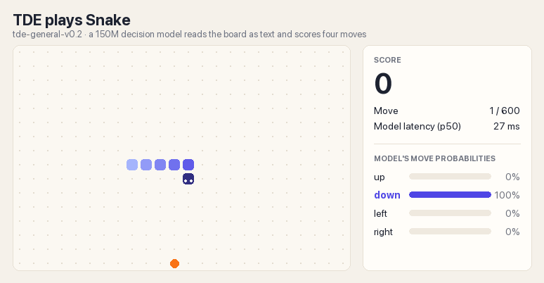

# 用一台 Mac 教会 TDE 玩贪吃蛇



TDE 是一个 1.5 亿参数的决策模型：给它一段局面描述、一个问题和几个候选项，一次前向就给出每个候选项的概率，不生成文字。这个教程把通用模型 `tde-general-v0.1` 微调成会玩贪吃蛇的 [`tde-general-v0.2`](https://huggingface.co/tdelab/tde-general-v0.2)，全程只用一台 Apple Silicon Mac。

评测设定：24×16 棋盘、初始长度 6、种子 101–104、每局 600 步：

| | 每局吃到的食物 | 活满 600 步 |
|---|---|---|
| tde-general-v0.2 + 防困死 | 39 / 38 / 40 / 38，平均 38.75 | 4 局全部 |

每步约 12 ms（M5 Pro，MLX）。通用能力基本保留：在 7 个公开数据集上准确率 86.4%，v0.1 是 87.4%。

## 1. 先看演示（约 5 分钟）

```bash
git clone https://github.com/e13ven-arch/tde && cd tde
python3.12 -m venv .venv && source .venv/bin/activate
pip install -e . mlx
python -m integrations.snake.demo
```

浏览器打开 http://localhost:8765 ，模型会一局接一局地自己玩。第一次运行会从 Hugging Face 下载模型（约 600 MB）。

## 2. 模型怎么"看"棋盘

棋盘直接写成文本，每个格子正好是一个 token：`.` 是空格，`F` 是食物，`H` 是蛇头，数字表示这一格还要几步才会空出来（尾巴是 1）。

```
Length 4. Heading left.
 . . . . . . . .
 . F . . . . . .
 . . . . H 3 . .
 . . . . . 2 . .
 . . . . . 1 . .
 . . . . . . . .
 . . . . . . . .
 . . . . . . . .
```

问题是 `Which way should the snake move?`，候选项是 `up / down / left / right`。模型给四个方向各打一个概率，走概率最高的那个。演示页面右侧的条形图就是这四个概率。

## 3. 自己训练一个（约 1.5 小时）

```bash
# 起点模型：tde-general-v0.1（约 600 MB）
hf download tdelab/tde-general-v0.1 --local-dir release/tde-general-v0.1

# 造数据：8×8、12×12、24×16 三种棋盘共 10 万个局面，每个局面标上该往哪走（不到 1 分钟，只用 CPU）
python -m integrations.snake.build_sft --out data/snake/bfs_v1

# 用 MLX 在 Mac 的 GPU 上微调 2 轮（我这次用了 79 分钟，M5 Pro）
python -m tde.mlx.train --data_dir data/snake/bfs_v1 --init release/tde-general-v0.1 \
    --out_dir runs/my-snake --max_state_tokens 480 --epochs 2

# 评测：留出种子 + 24×16 标准协议，分别看不加保护、一步保护和防困死
python -m integrations.snake.play runs/my-snake --standard

# 用自己的模型开演示
python -m integrations.snake.demo --model runs/my-snake
```

标签来自一个简单的寻路程序：朝食物走最短路，并且保证吃完以后还能追到自己的尾巴；实在没有这样的路，就往空间最大的方向走。模型学的是这些标签，走棋时不再调用这个程序。

## 4. 防困死

模型单独玩时吃得不少（平均 21.75 个），但早晚会把自己关进死胡同，4 局都没活过 600 步。演示里加了一层防困死：如果模型最想走的方向会让蛇头够不着自己的尾巴，就换成模型的下一个选择；其余时候完全按模型的选择走。代码在 `play.py` 的 `shield="trap"`，页面上被换掉的那一步会用粉色标出来。

## 5. 踩过的坑

- **MLX 显存缓存会越涨越大。** 每次推理的 batch 大小都不一样，MLX 会把每种大小的缓冲都留着，涨到 17–25 GB 后系统开始 swap，速度只剩三分之一。加一行 `mx.set_cache_limit(4 << 30)` 就好了。
- **MLX 编译缓存只记得几种输入形状。** 不同长度的 batch 随机混着喂，几乎每一步都在重新编译（1.5 秒一步）；在 256 个 batch 的窗口里按长度排好序再喂，降到 0.8 秒一步。
- **只靠对局结果训练（RLCD-style，`rlcd.py`）比直接学标签难得多。**
  - 用模型自己的贪心走法去模拟、再拿结果当目标：蛇学会了原地绕圈，不死，但 500 步只吃 0.4 个。
  - 改用随机模拟（每个方向随机走几百局取平均）当目标，能学会吃，但同样的训练量下 8×8 只有 11–15 个，直接学寻路标签是 27.5 个。把损失换成交叉熵也只好一点，差距主要来自目标本身。

## 6. 文件

| 文件 | 作用 |
|---|---|
| `game.py` | 游戏环境和棋盘文本 |
| `encode.py` | 把棋盘直接查表编码成模型输入，比逐个调用分词器快 |
| `teacher.py`、`build_sft.py` | 寻路标签和训练数据 |
| `play.py` | 评测、一步保护、防困死 |
| `demo.py`、`demo.html` | 实时演示页面 |
| `record.py` | 把一局渲染成上面的 GIF |
| `rlcd.py`、`montecarlo.py` | 只靠对局结果训练（进阶，见第 5 节） |
| `../../tde/mlx/` | MLX 训练器 |
